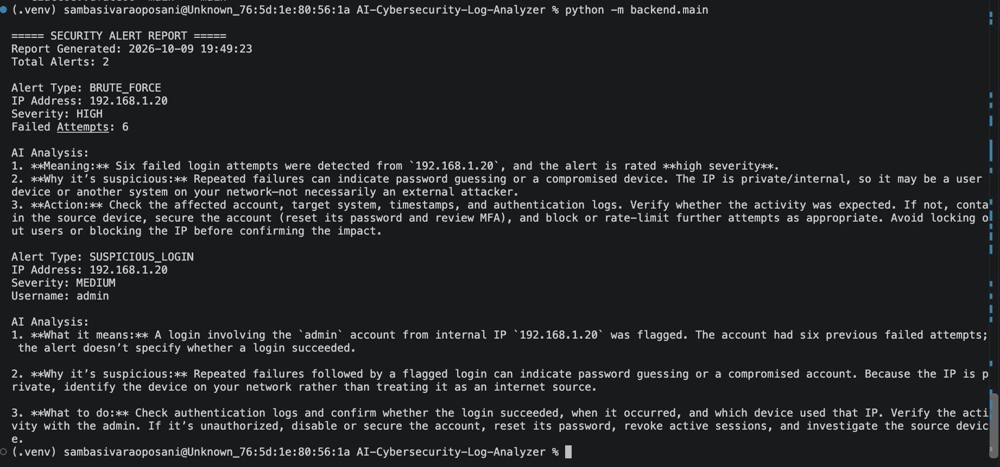

A beginner-friendly Python cybersecurity project that analyzes authentication logs, detects suspicious login activity, and uses AI to explain security alerts.

## Tech Stack

- Python
- OpenAI API
- python-dotenv
- JSON
- Git & GitHub
- VS Code

## Features

- Parses authentication log files
- Detects repeated failed login attempts
- Detects suspicious successful logins after multiple failures
- Assigns security severity levels
- Uses OpenAI for AI-powered security analysis
- Generates recommended security actions
- Saves alerts to a JSON file
- Generates a readable security report

## How It Works

1. Reads authentication logs from `data/sample.log`
2. Detects repeated failed login attempts
3. Identifies suspicious login activity
4. Assigns a security severity level
5. Sends detected alerts to OpenAI for analysis
6. Generates recommended security actions
7. Saves the results to `data/alerts.json`

## Setup

### 1. Clone the repository

```bash
git clone https://github.com/sivaposani/AI-Cybersecurity-Log-Analyzer.git
cd AI-Cybersecurity-Log-Analyzer

### 2. Create a virtual environment

```bash
python3 -m venv .venv
source .venv/bin/activate

### 3. Install dependencies

```bash
pip install -r requirements.txt

### 4. Configure the OpenAI API key

Create a `.env` file in the project root and add:

```env
OPENAI_API_KEY=your_api_key_here
```

Replace `your_api_key_here` with your OpenAI API key.

Do not commit or share your API key.

### 5. Run the project

From the project root, activate your virtual environment and run:

```bash
python -m backend.main
```

## Project Structure

```text
AI-Cybersecurity-Log-Analyzer/
│
├── backend/
│   └── main.py
│
├── data/
│   ├── sample.log
│   └── alerts.json
│
├── models/
│   └── analyzer.py
│
├── docs/
│
├── .gitignore
├── .env
└── README.md

## Security Alert Report

The screenshot below shows the analyzer detecting a brute-force pattern and a suspicious login, with AI-generated explanations and recommended actions.

